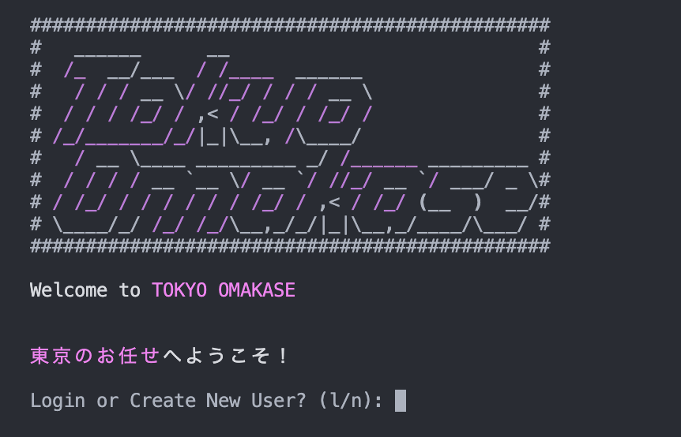

# Tokyo Omakase 東京のお任せ

Tokyo Omakase is your guide to Tokyo's best restaurants. You can do the following 

## Install and Run


This creates an environment to control dependencies

```
python lib/cli_main.py
```
Run Tokyo Omakase


## Welcome Page

After logging in, you will be prompted to either login or create a new account. 

### Login
To login to an existing account, enter 'l' and press enter. It will then prompt you to 'Enter User Name', enter in your username (including capitalization) and hit enter. If your account does not exist you will be prompted to choose between login and creating a user.


### Create a New User
To create anew user, enter 'n' and press enter. It will then prompt you to 'Enter New User Name', enter in your username an hit enter. 



## Home Page

The home page has 3 options available for you to choose...

1. Restaurants
2. Visits
3. Users

In this application, you can navigate to different menus by entering the corresponding menu number and hitting enter. You can go back in the directory by entering 'x' and hitting enter. By entering 'q' and hitting enter you can exit the entire program. At some points the application will prompt you with different commands, those will be available on the command line.

## Restaurants
Tokyo Omakase comes preloaded with nearly 200 Michellin rated restaurants that you can browse. There are 3 different ways to browse the restaurants...

Browse through our entire catalog with View All Restaurants.


Looking for a particular type of food? Filter by Cuisine to find the perfect restaurant to satisfy your craving.


Need to find something close by? Filter By Location, to find the highest quality restaurants near you!


From the Restaurant List, you can navigate to a specific restaurant by typing its ID# from the left. This allows you to see additional details about the restaurant as well as see other user's visits or add one of your own.


## Users

